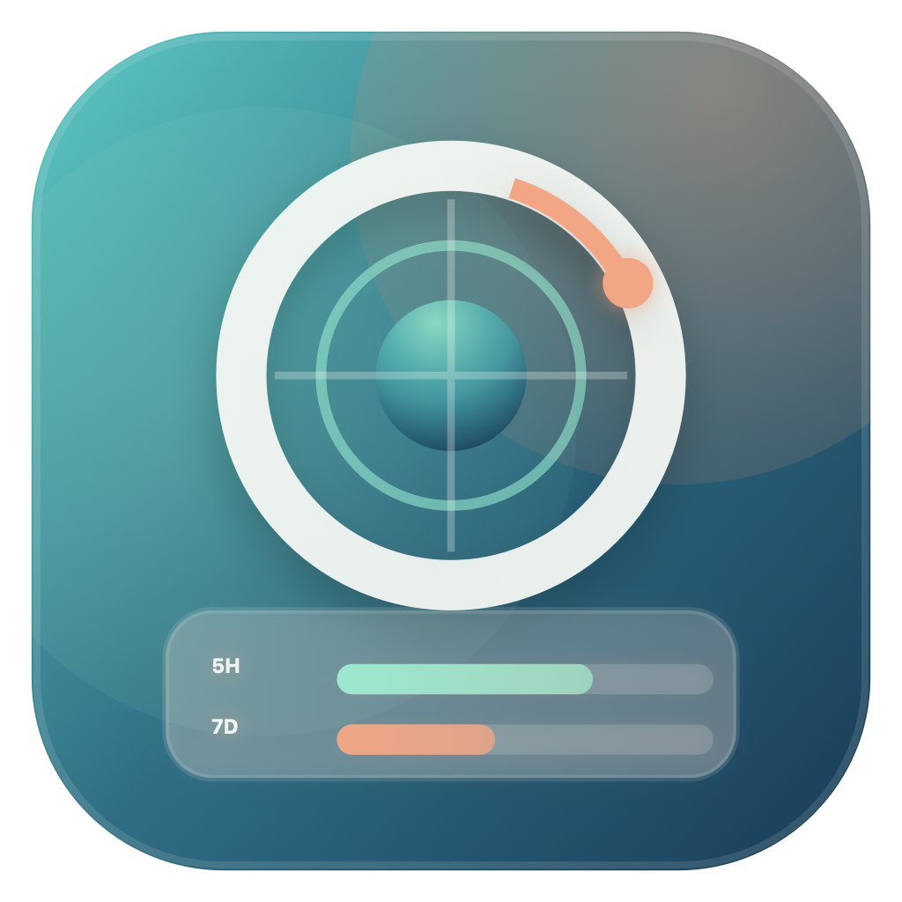

<p align="center">
  
</p>

<p align="center">
  <a href="./README.md">English</a> | 简体中文
</p>

# ClaudeScope

ClaudeScope 是一个 macOS 菜单栏小工具，用来快速查看 Claude 用量。

你可以在菜单栏直接看到 5 小时和 7 天窗口的使用情况，点开后还能查看更详细的用量、按模型统计、重置时间、历史趋势图和额外额度。

## 功能

- 菜单栏图标直接显示 5 小时和 7 天使用率
- 弹出面板显示各窗口详细用量、按模型统计和重置时间
- 支持额外额度显示
- 历史趋势图支持 `1h / 6h / 1d / 7d / 30d`
- 支持 OAuth 登录，无需手动管理 API Key
- 支持轮询间隔设置
- 支持 Sparkle 应用更新
- 支持英文与简体中文切换

## 安装

你可以按自己习惯选择：

### 1. DMG 安装

适合大多数用户。

1. 从 [latest release](https://github.com/Kevin-Wei-sudo/claude-scope/releases/latest) 下载 `ClaudeScope.dmg`
2. 打开 DMG，把 `ClaudeScope.app` 拖到“应用程序”
3. 从“应用程序”中打开 `ClaudeScope`
4. 如果首次启动被拦截，右键应用后选择“打开”

### 2. Homebrew Cask

如果你之后发布了自己的 tap，可以这样安装：

```sh
brew install --cask Kevin-Wei-sudo/tap/claude-scope
```

更多说明见 [docs/HOMEBREW_CASK.md](docs/HOMEBREW_CASK.md)。

### 3. 一键安装脚本

```sh
curl -fsSL https://raw.githubusercontent.com/Kevin-Wei-sudo/claude-scope/main/scripts/install.sh | bash
```

可选安装方式：

```sh
curl -fsSL https://raw.githubusercontent.com/Kevin-Wei-sudo/claude-scope/main/scripts/install.sh | bash -s -- --install-method zip
curl -fsSL https://raw.githubusercontent.com/Kevin-Wei-sudo/claude-scope/main/scripts/install.sh | bash -s -- --install-method git
```

### 4. 从源码构建

需要：

- macOS 14+
- Xcode 15+
- Swift 5.9+

```sh
git clone https://github.com/Kevin-Wei-sudo/claude-scope.git
cd claude-scope
make app
make dmg
make install
```

## 首次使用

1. 启动应用，菜单栏会出现图标
2. 点击图标，选择 **Sign in with Claude**
3. 浏览器完成授权
4. 把返回的 code 粘贴回应用

## 常用命令

```sh
make build
make app
make zip
make dmg
make release-artifacts
make verify-release
make install
make clean
```

## 数据存储

本地数据默认保存在：

```text
~/.config/claude-scope/
```

- `token`: OAuth token
- `history.json`: 30 天历史用量数据

## 发布

当前项目使用 tag 驱动发布。推送 `v*` tag 后会自动：

- 构建 `.app`
- 生成 `ClaudeScope.zip` 和 `ClaudeScope.dmg`
- 创建 GitHub Release
- 生成 Sparkle `appcast.xml`

示例：

```sh
git tag v0.1.0
git push origin v0.1.0
```

## 许可证

[BSD 2-Clause](LICENSE)
